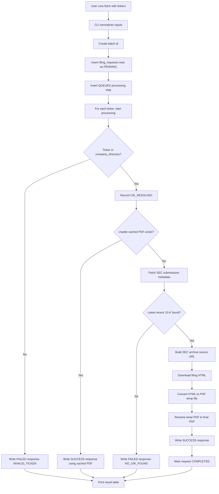

# Functional Documentation: k10fetcher

## Product Summary - homework

`k10fetcher` is a local CLI that fetches latest SEC 10-K filings for one or more tickers, converts the SEC filing HTML to PDF, stores all request/output state in SQLite, writes JSON-lines logs, and prints terminal status tables.

adding conflict

The user-facing workflow is:

```bash
uv run k10fetcher bootstrap
uv run k10fetcher fetch ORCL GOOGL
uv run k10fetcher status
```

## Functional Capabilities

| Capability | Description |
| --- | --- |
| Runtime check | `doctor` shows SQLite availability, runtime directory, DB path, and rate-limit config. |
| Company bootstrap | `bootstrap` downloads SEC ticker mappings and warms `company_directory`. |
| Batch fetch | `fetch` accepts space-separated or comma-separated tickers and processes them sequentially. |
| Failure visibility | Invalid tickers, missing 10-K filings, SEC errors, conversion errors, and filesystem errors are visible in terminal, DB, and logs. |
| Status view | `status` shows recent request and response state and can filter by `--batch-id`. |
| Local output | PDFs are written under `.k10fetcher/data/active/{ticker}/10-K/`. |
| Local audit | SQLite tables and JSON logs preserve what happened and why. |

## Complete Functional Flow



## Command Behavior

### `doctor`

Checks local runtime setup.

Sample command:

```bash
uv run k10fetcher doctor
```

Sample output:

```text
[1/4] Python SQLite driver: OK
    sqlite3 module available; SQLite library version 3.45.3.
[2/4] Application directory: OK
    /path/to/sec-filing/.k10fetcher
[3/4] Database path: OK
    /path/to/sec-filing/.k10fetcher/k10fetcher.db
[4/4] SEC rate limit: OK
    Configured for 10 requests/second.
Runtime checks completed.
```

### `bootstrap`

Initializes SQLite and warms the company directory from SEC.

Sample command:

```bash
uv run k10fetcher bootstrap
```

What happens:

1. Runtime folders are created if missing.
2. SQLite schema is initialized idempotently.
3. Existing `company_directory` row count is checked.
4. If rows exist and `--force` is not provided, SEC fetch is skipped.
5. If empty or forced, SEC `company_tickers.json` is fetched.
6. Rows are normalized and upserted by ticker.

Sample `CompanyDirectoryEntry` model:

```json
{
  "cik": "0001652044",
  "ticker": "GOOGL",
  "company_name": "Alphabet Inc."
}
```

Stored in `company_directory`:

```json
{
  "id": 1,
  "cik": "0001652044",
  "ticker": "GOOGL",
  "company_name": "Alphabet Inc.",
  "created_at": "2026-06-15 12:00:00",
  "updated_at": "2026-06-15 12:00:00"
}
```

### `fetch`

Submits and processes one batch.

Sample command:

```bash
uv run k10fetcher fetch ORCL GOOGL
```

Input normalization:

| User input | Normalized ticker |
| --- | --- |
| `orcl` | `ORCL` |
| `GOOGL` | `GOOGL` |
| `ORCL,googl` | `ORCL`, `GOOGL` |

What happens for each ticker:

1. A `filing_requests` row is inserted with `PENDING`.
2. A `filing_processing_steps` row is inserted with `QUEUED`.
3. Request status changes to `PROCESSING`.
4. The ticker is resolved through `company_directory`.
5. Existing successful PDF cache is checked unless `--no-cache` is used.
6. SEC submissions metadata is fetched and parsed.
7. Latest `10-K` is selected.
8. Filing archive HTML is downloaded.
9. PDF is written to temp path and renamed atomically.
10. `filing_responses` is written as `SUCCESS`.
11. `filing_requests` is marked `COMPLETED`.
12. A terminal result table is printed.

During long steps, the console shows same-line progress:

```text
WMT | Convert PDF.
WMT | Convert PDF..
WMT | Convert PDF...
```

When a step completes, the dots disappear and the step prints as done.

### `status`

Shows recent request/response state.

Sample command:

```bash
uv run k10fetcher status --limit 10
```

Batch-filtered sample:

```bash
uv run k10fetcher status --batch-id 79d4d2ac16274513a6621974b432136d
```

## Layer-By-Layer Models

## CLI Layer

### Input Model

The CLI receives raw strings from Typer:

```json
{
  "tickers": ["ORCL", "GOOGL"],
  "db_path": ".k10fetcher/k10fetcher.db",
  "data_dir": ".k10fetcher/data",
  "rate_limit": 10,
  "no_cache": false,
  "log_path": ".k10fetcher/logs/k10fetcher.log"
}
```

After parsing:

```json
{
  "normalized_tickers": ["ORCL", "GOOGL"]
}
```

### Output Model

The CLI prints `ProcessResult` rows:

```json
{
  "ticker": "ORCL",
  "status": "SUCCESS",
  "destination_or_error": ".k10fetcher/data/active/ORCL/10-K/ORCL_10-K_2025-06-18.pdf"
}
```

Failure sample:

```json
{
  "ticker": "INVALIDXYZ",
  "status": "FAILED",
  "destination_or_error": "INVALID_TICKER: not found in SEC company directory"
}
```

## Repository Layer

### `FilingRequest`

Created after request submission.

```json
{
  "id": 12,
  "batch_id": "79d4d2ac16274513a6621974b432136d",
  "raw_input": "GOOGL",
  "normalized_ticker": "GOOGL",
  "status": "PENDING",
  "error_reason": null
}
```

Stored DB row:

```json
{
  "id": 12,
  "batch_id": "79d4d2ac16274513a6621974b432136d",
  "raw_input": "GOOGL",
  "normalized_ticker": "GOOGL",
  "status": "PENDING",
  "error_reason": null,
  "requested_at": "2026-06-15 12:00:00",
  "started_at": null,
  "completed_at": null
}
```

### `filing_processing_steps`

Append-only row sample:

```json
{
  "id": 44,
  "request_id": 12,
  "step": "METADATA_FETCHED",
  "message": "Found 0001652044-25-000063 filed 2025-02-05.",
  "created_at": "2026-06-15 12:00:04"
}
```

### `FilingResponseData`

Used to persist success:

```json
{
  "ticker": "GOOGL",
  "cik": "0001652044",
  "company_name": "Alphabet Inc.",
  "form_type": "10-K",
  "filing_date": "2025-02-05",
  "accession_number": "0001652044-25-000063",
  "source_url": "https://www.sec.gov/Archives/edgar/data/1652044/000165204425000063/goog-20241231.htm",
  "pdf_path": ".k10fetcher/data/active/GOOGL/10-K/GOOGL_10-K_2025-02-05.pdf"
}
```

Stored `filing_responses` success sample:

```json
{
  "request_id": 12,
  "ticker": "GOOGL",
  "cik": "0001652044",
  "company_name": "Alphabet Inc.",
  "form_type": "10-K",
  "filing_date": "2025-02-05",
  "accession_number": "0001652044-25-000063",
  "source_url": "https://www.sec.gov/Archives/edgar/data/1652044/000165204425000063/goog-20241231.htm",
  "status": "SUCCESS",
  "pdf_path": ".k10fetcher/data/active/GOOGL/10-K/GOOGL_10-K_2025-02-05.pdf",
  "error_reason": null
}
```

Stored failure sample:

```json
{
  "request_id": 13,
  "ticker": "INVALIDXYZ",
  "cik": null,
  "company_name": null,
  "form_type": "10-K",
  "filing_date": null,
  "accession_number": null,
  "source_url": null,
  "status": "FAILED",
  "pdf_path": null,
  "error_reason": "INVALID_TICKER: not found in SEC company directory"
}
```

### `RecentFilingStatus`

Returned by `status`:

```json
{
  "request_id": 12,
  "batch_id": "79d4d2ac16274513a6621974b432136d",
  "ticker": "GOOGL",
  "request_status": "COMPLETED",
  "response_status": "SUCCESS",
  "filing_date": "2025-02-05",
  "pdf_path": ".k10fetcher/data/active/GOOGL/10-K/GOOGL_10-K_2025-02-05.pdf",
  "error_reason": null,
  "requested_at": "2026-06-15 12:00:00",
  "completed_at": "2026-06-15 12:00:35"
}
```

## SEC Client Layer

### Company Tickers Input From SEC

SEC source shape:

```json
{
  "0": {
    "cik_str": 1652044,
    "ticker": "GOOGL",
    "title": "Alphabet Inc."
  }
}
```

Normalized model:

```json
{
  "cik": "0001652044",
  "ticker": "GOOGL",
  "company_name": "Alphabet Inc."
}
```

### Submissions Metadata Input From SEC

Relevant SEC shape:

```json
{
  "filings": {
    "recent": {
      "form": ["8-K", "10-K"],
      "filingDate": ["2025-04-25", "2025-02-05"],
      "accessionNumber": ["0001652044-25-000070", "0001652044-25-000063"],
      "primaryDocument": ["goog-8k.htm", "goog-20241231.htm"]
    }
  }
}
```

Parsed `FilingMetadata`:

```json
{
  "ticker": "GOOGL",
  "cik": "0001652044",
  "company_name": "Alphabet Inc.",
  "form_type": "10-K",
  "filing_date": "2025-02-05",
  "accession_number": "0001652044-25-000063",
  "primary_document": "goog-20241231.htm",
  "source_url": "https://www.sec.gov/Archives/edgar/data/1652044/000165204425000063/goog-20241231.htm"
}
```

## PDF Layer

### Path Construction

Input:

```json
{
  "data_dir": ".k10fetcher/data",
  "ticker": "GOOGL",
  "form_type": "10-K",
  "filing_date": "2025-02-05"
}
```

Output:

```text
.k10fetcher/data/active/GOOGL/10-K/GOOGL_10-K_2025-02-05.pdf
```

### Atomic Conversion

Functional behavior:

1. Ensure target directory exists.
2. Delete stale temp file if present.
3. Convert HTML using WeasyPrint to `{target}.tmp`.
4. Replace final PDF with temp file.
5. If conversion fails, delete temp file and leave final PDF untouched.

## Logging Layer

Log file:

```text
.k10fetcher/logs/k10fetcher.log
```

Sample success logs:

```json
{"batch_id":"79d4d2ac16274513a6621974b432136d","request_id":1,"ticker":"AAPL","step":"PROCESSING_STARTED","event":"request_processing_started","level":"info","timestamp":"2026-06-15T12:40:12.437336Z"}
{"batch_id":"79d4d2ac16274513a6621974b432136d","request_id":1,"ticker":"AAPL","step":"METADATA_FETCHED","accession_number":"0000320193-25-000079","filing_date":"2025-10-31","event":"metadata_fetched","level":"info","timestamp":"2026-06-15T12:40:12.874210Z"}
{"batch_id":"79d4d2ac16274513a6621974b432136d","request_id":1,"ticker":"AAPL","step":"COMPLETED","duration_ms":32362,"pdf_path":".k10fetcher/data/active/AAPL/10-K/AAPL_10-K_2025-10-31.pdf","event":"request_completed","level":"info","timestamp":"2026-06-15T12:40:44.803298Z"}
```

Failure log sample:

```json
{"batch_id":"...","request_id":2,"ticker":"INVALIDXYZ","step":"FAILED","error":"INVALID_TICKER: not found in SEC company directory","event":"request_failed","level":"warning","timestamp":"2026-06-15T12:41:00Z"}
```

## Error Categories

| Error | When it happens | User-visible result |
| --- | --- | --- |
| `INVALID_TICKER` | Ticker not found in `company_directory` | Failed row and explicit message |
| `NO_10K_FOUND` | SEC submissions has no recent 10-K | Failed row and explicit message |
| `SEC_HTTP_ERROR` | SEC HTTP request fails | Failed row and HTTP error text |
| `PDF_CONVERSION_FAILED` | WeasyPrint conversion fails | Failed row; temp file removed |
| `FILESYSTEM_ERROR` | Local write/rename fails | Failed row with filesystem error |

## Cache Behavior

If `--no-cache` is not provided, the pipeline checks for an existing successful response for the ticker with a PDF path. If the file still exists, it writes the new request as a success with `CACHE_HIT` and reuses the existing PDF.

Functional cache example:

```json
{
  "new_request_status": "COMPLETED",
  "response_status": "SUCCESS",
  "processing_step": "CACHE_HIT",
  "pdf_path": ".k10fetcher/data/active/AAPL/10-K/AAPL_10-K_2025-10-31.pdf"
}
```

## Rate Limiting Behavior

Every SEC HTTP request calls `RateLimiter.acquire()` before the request. The wait happens outside SQLite transactions.

Requests covered:

- `company_tickers.json` during bootstrap.
- `submissions/CIK##########.json` during metadata fetch.
- SEC Archives HTML during filing download.

## Acceptance Examples

Successful fetch:

```text
Batch submitted: 79d4d2ac16274513a6621974b432136d
Requests created: 1
Tickers: AAPL
Rate limit: 10 SEC requests/second; no_cache=False
AAPL | Fetch metadata done
AAPL | Download filing HTML done
AAPL | Convert PDF done

Input | Status  | Destination / Error
AAPL  | SUCCESS | .k10fetcher/data/active/AAPL/10-K/AAPL_10-K_2025-10-31.pdf
```

Invalid ticker:

```text
Input      | Status | Destination / Error
INVALIDXYZ | FAILED | INVALID_TICKER: not found in SEC company directory
```

Empty company directory symptom:

```text
ORCL  | FAILED | INVALID_TICKER: not found in SEC company directory
GOOGL | FAILED | INVALID_TICKER: not found in SEC company directory
```

Resolution:

```bash
uv run k10fetcher bootstrap --force
```
