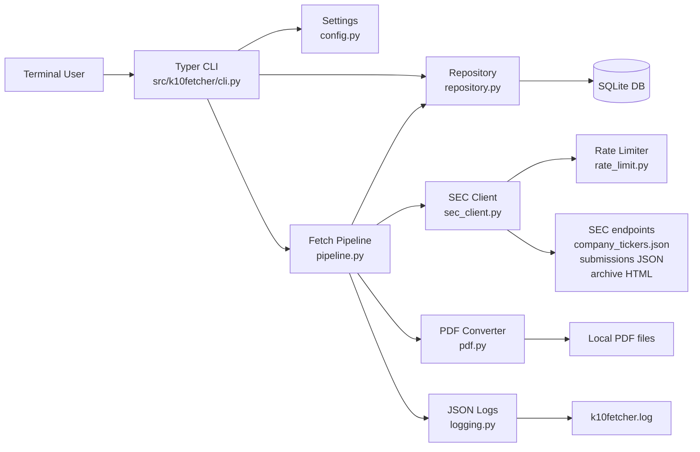
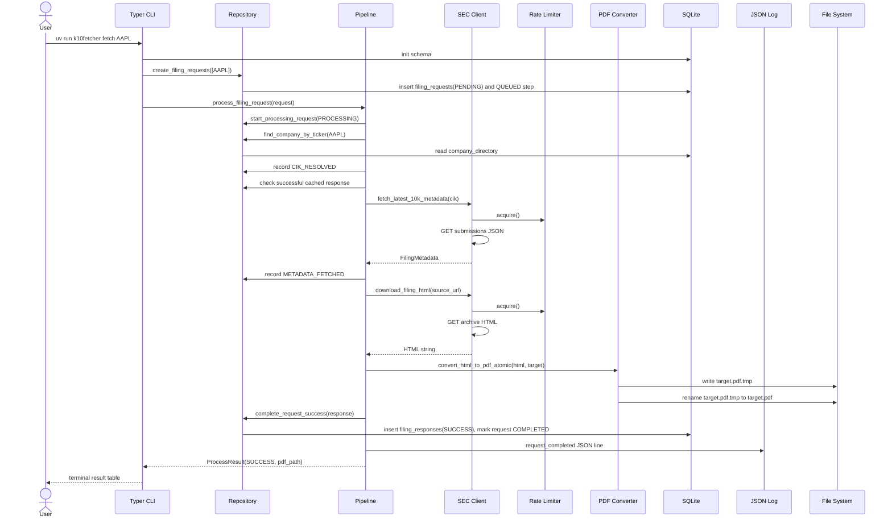
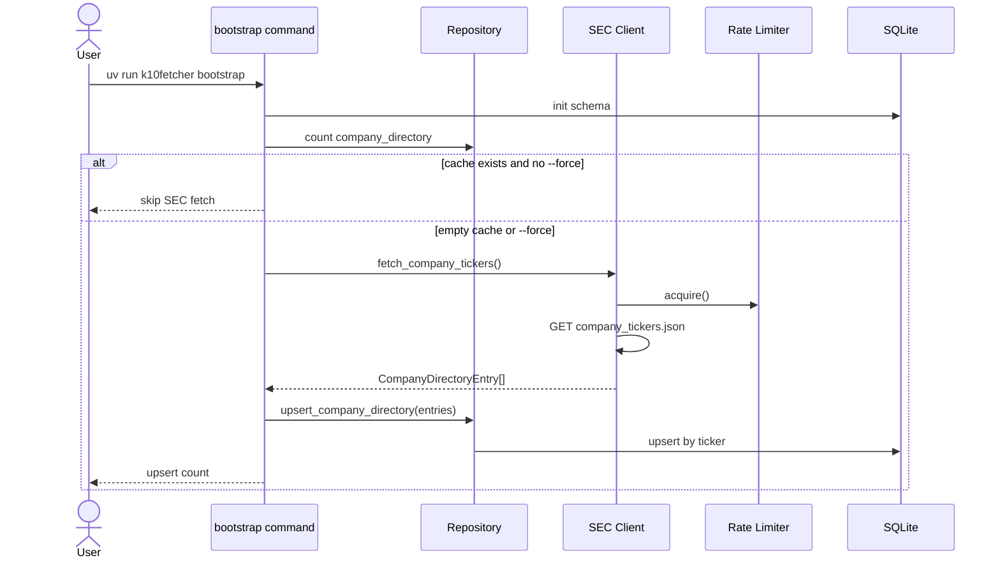
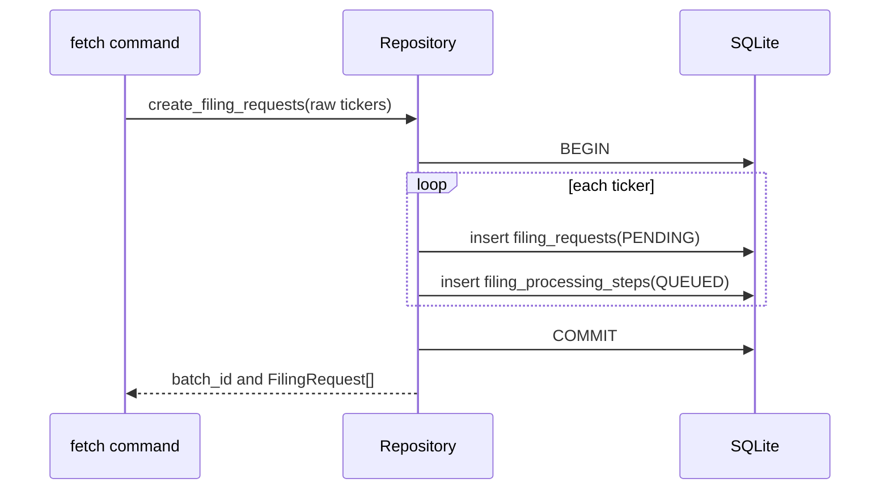
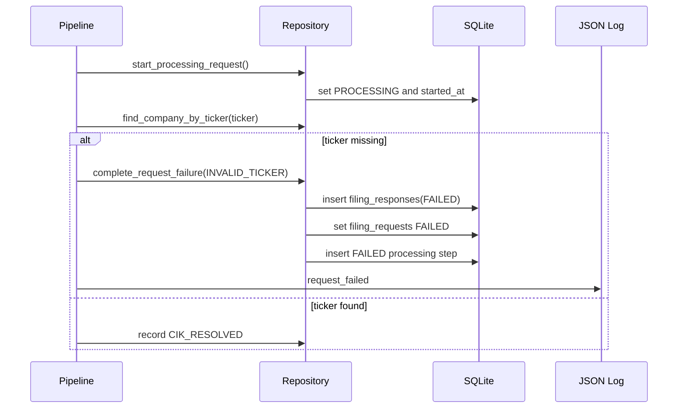
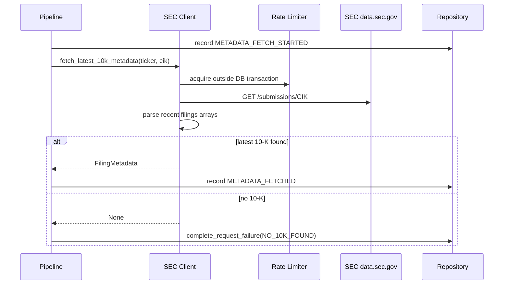
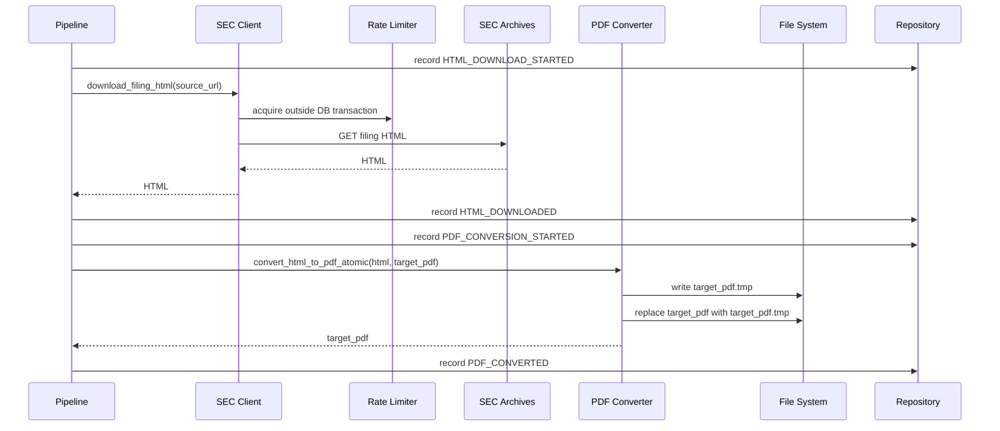
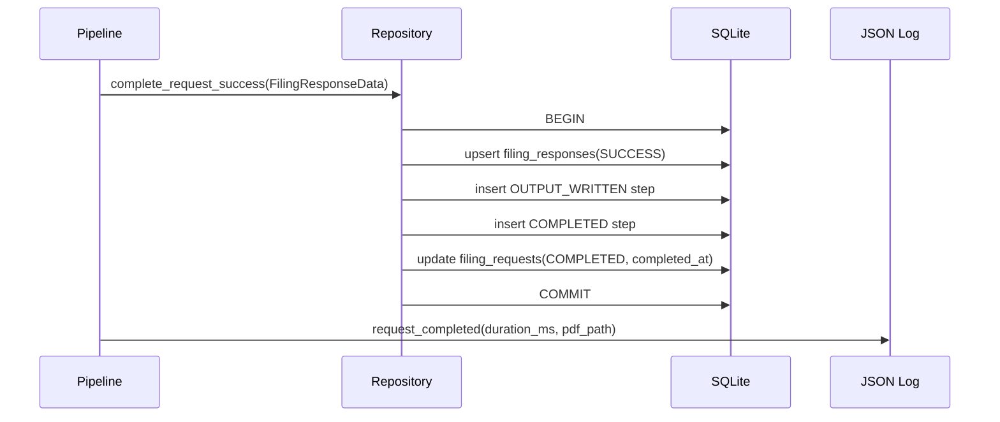
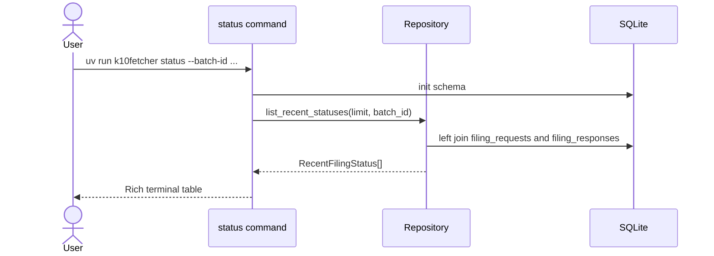
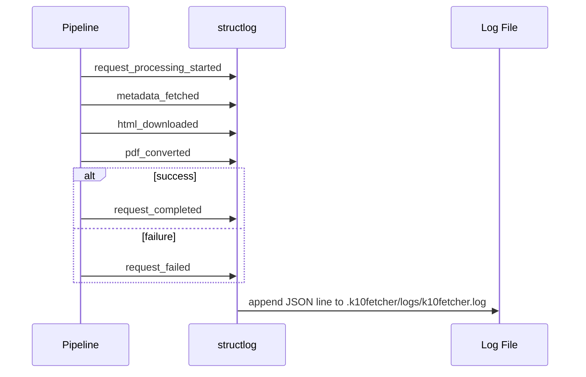

# Technical Documentation: k10fetcher

## Audience And Scope

This document is for developers, testers, product owners, scrum masters, architects, and security reviewers. It describes the local CLI architecture, component responsibilities, runtime flows, data boundaries, and test/security considerations for the `k10fetcher` MVP.

The product is intentionally local-first: no Redis, Celery, web server, broker, scheduler, or daemon. A CLI process starts, performs the requested work, writes SQLite/PDF/log artifacts, prints terminal output, and exits.

## Stakeholder View

| Role | Primary concern | Where to look |
| --- | --- | --- |
| Developer | Module boundaries, extension points, transaction rules | Components, module details, sequence diagrams |
| Tester | Observable behavior, mocked SEC calls, failure modes | Test strategy, flow diagrams, error handling |
| Product Owner | User workflow, status visibility, deliverable behavior | End-to-end flow, CLI commands, outputs |
| Scrum Master | Milestone tracking and acceptance | ExecPlan, validation commands, risks |
| Architect | Data flow, dependencies, rate limiting, persistence | Component diagram, sequence diagrams, storage model |
| Security | External calls, local files, logs, failure containment | Security section, data classification, controls |

## Runtime Defaults

The default runtime directory is project-local:

```text
/Users/manishhmundra/dev/company/sec-filing/.k10fetcher
```

Default artifacts:

```text
.k10fetcher/k10fetcher.db
.k10fetcher/data/active/{ticker}/10-K/{ticker}_10-K_{filing_date}.pdf
.k10fetcher/logs/k10fetcher.log
```

The runtime root can be overridden with `K10FETCHER_APP_DIR`. Individual CLI runs can override paths with `--db-path`, `--data-dir`, and `--log-path`.

## High-Level Component Diagram



## Component Responsibilities

| Component | File | Responsibility |
| --- | --- | --- |
| CLI | `src/k10fetcher/cli.py` | User commands, terminal tables, progress animation, CLI options |
| Config | `src/k10fetcher/config.py` | Runtime defaults, app directory, SEC User-Agent settings |
| DB | `src/k10fetcher/db.py` | SQLite connection, schema initialization, transaction helper |
| Repository | `src/k10fetcher/repository.py` | SQL access, row dataclasses, atomic state transitions |
| SEC Client | `src/k10fetcher/sec_client.py` | SEC HTTP calls, SEC payload parsing, archive URL construction |
| Rate Limiter | `src/k10fetcher/rate_limit.py` | Sliding-window SEC request limiter |
| PDF | `src/k10fetcher/pdf.py` | PDF path construction, WeasyPrint conversion, temp-file rename |
| Pipeline | `src/k10fetcher/pipeline.py` | End-to-end orchestration for one filing request |
| Logging | `src/k10fetcher/logging.py` | Structlog JSON-lines log configuration |

## External Dependencies

| Dependency | Use |
| --- | --- |
| `typer` | CLI command framework |
| `rich` | Terminal tables and readable output |
| `httpx` | SEC HTTP requests |
| `weasyprint` | HTML to PDF conversion |
| `structlog` | JSON-lines structured logs |
| `sqlite3` | Local database using Python standard library |
| `pytest`, `respx` | Automated tests and mocked HTTP |
| `ruff` | Linting and formatting |

## High-Level End-To-End Sequence



## Bootstrap Sequence



## Request Submission Sequence



## Ticker Resolution And Failure Sequence



## Metadata Fetch Sequence



## HTML Download And PDF Conversion Sequence



## Success Persistence Sequence



## Status Sequence



## Logging Sequence



## SQLite Tables

### `company_directory`

Stores SEC ticker-to-CIK mappings. `ticker` is unique; `cik` is not unique because a company can have multiple share classes/tickers.

### `filing_requests`

Stores one row per submitted ticker. Status values: `PENDING`, `PROCESSING`, `COMPLETED`, `FAILED`.

### `filing_processing_steps`

Append-only audit trail for each request. Important steps include `QUEUED`, `PROCESSING_STARTED`, `CIK_RESOLVED`, `METADATA_FETCH_STARTED`, `METADATA_FETCHED`, `HTML_DOWNLOAD_STARTED`, `HTML_DOWNLOADED`, `PDF_CONVERSION_STARTED`, `PDF_CONVERTED`, `OUTPUT_WRITTEN`, `COMPLETED`, `FAILED`, and `CACHE_HIT`.

### `filing_responses`

Stores one final row per request, either `SUCCESS` with PDF/file metadata or `FAILED` with an explicit error reason.

## Transaction Model

Database operations are short and explicit:

- Request submission inserts `filing_requests` and `QUEUED` steps in one transaction.
- Processing start updates the request and appends a step in one transaction.
- Each audit step is committed independently.
- Success persistence writes the response, output step, completed step, and completed request state in one transaction.
- Failure persistence writes the failed response, failed request state, and failed step in one transaction.
- SEC HTTP calls and rate-limit waits never run inside SQLite transactions.
- PDF conversion completes before a request is marked `COMPLETED`.

## Security Considerations

| Area | Current control | Notes |
| --- | --- | --- |
| External HTTP | SEC-only endpoints used by code paths | No arbitrary user-provided download URL in CLI. Archive URLs are derived from SEC metadata. |
| Rate limiting | Shared process limiter before SEC requests | Default is 10 requests per second. |
| Local persistence | Project-local `.k10fetcher` directory | Keeps artifacts inspectable during development. Consider permissions if used on shared machines. |
| Logs | JSON-lines operational logs | Logs include tickers, CIKs, SEC accession numbers, paths, and errors. No secrets are expected. |
| User input | Tickers normalized to uppercase | Invalid tickers become explicit failed rows. |
| File writes | PDF output path is derived from normalized metadata | Temp file is removed on conversion failure. |
| Dependencies | `uv` and pinned lock file workflow | Keep dependency updates reviewed because WeasyPrint and HTTP clients are security-relevant. |

## Test Strategy

The automated suite uses mocked SEC responses for deterministic behavior. Key test classes:

- CLI parsing and command behavior.
- SQLite schema creation and idempotence.
- Atomic repository transitions.
- Company directory bootstrap parsing and upsert behavior.
- SEC submissions parsing and archive URL construction.
- Rate limiter behavior without real sleeping.
- HTML download and PDF conversion atomic rename behavior.
- End-to-end fetch success and failure with mocked HTTP.
- JSON-lines logging shape.
- Project-local runtime path defaults.

Run:

```bash
uv run pytest
uv run ruff check .
uv run ruff format --check .
scripts/check.sh
```

## Operational Notes

Recommended first run:

```bash
uv sync
uv run k10fetcher doctor
uv run k10fetcher bootstrap
uv run k10fetcher fetch AAPL META GOOGL
uv run k10fetcher status
```

If tickers fail as `INVALID_TICKER`, check whether `company_directory` is empty and rerun:

```bash
uv run k10fetcher bootstrap --force
```
